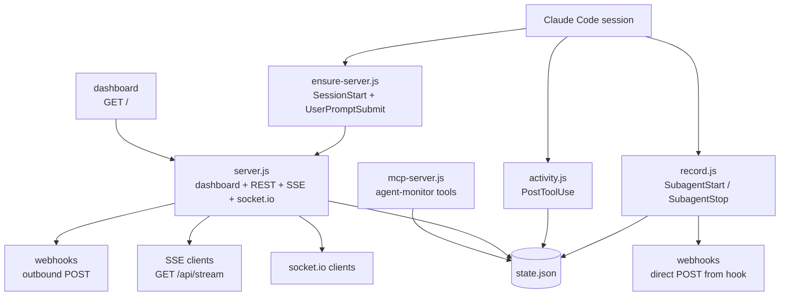

# Architecture

> Status: Final
> Last updated: 2026-10-06

## Contents

- [Component diagram](#component-diagram)
- [Data flow](#data-flow)
- [Components](#components)
- [Runtime files](#runtime-files)
- [Key decisions](#key-decisions)

## Component diagram

## Data flow

The single source of truth is `state.json` in the runtime directory. The flow is hook to file to transports:

1. `SubagentStart` hook pipes hook JSON on stdin to `record.js start`, which writes or refreshes the agent entry with status `running` and appends a `spawn` event. It then POSTs `agent.spawn` directly to registered webhooks.
2. `PostToolUse` hook pipes hook JSON on stdin to `activity.js`, which appends one activity entry (timestamp, tool name, summary), updates `last_summary` and `last_activity_at`, and records distinct file paths, keeping at most 50 activity entries and 30 files per agent.
3. `SubagentStop` hook pipes hook JSON on stdin to `record.js stop`, which flips the agent entry to `done` with a stop time, appends a `stop` event, and POSTs `agent.stop` directly to registered webhooks.
4. `server.js` polls `state.json` every 1 second. New events since the last poll are broadcast to SSE clients as `data:` lines and to socket.io clients as `agent-event`. The same poll marks a `running` agent stale after 2 minutes without activity.
5. Dashboard, REST, SSE, socket.io, and MCP all read the same `state.json`, so every surface shows the same agents, events, webhooks, and transport flags.
6. `ensure-server.js` runs on `SessionStart` and on every `UserPromptSubmit` (quiet mode). It probes candidate ports with `GET /__health` and either reuses or adopts a healthy monitor, kills and replaces a dead monitor-owned entry, or steps upward past foreign ports, then spawns `server.js` detached and records it in `server.json`.

## Components

| Component | File | Role |
|-----------|------|------|
| Hook wiring | `hooks/hooks.json` | Registers `SessionStart`, `UserPromptSubmit` (with `--quiet`), `SubagentStart`, `SubagentStop`, and `PostToolUse` with a tool matcher |
| Server bootstrap | `hooks/ensure-server.js` | Port probe, ownership rules, detached spawn of `server.js`, `server.json` bookkeeping, 100 KB log rotation |
| Lifecycle recorder | `hooks/record.js` | Reads stdin hook JSON, resolves agent id and type with fallbacks, writes agent entry, pushes event, fires webhooks |
| Activity recorder | `hooks/activity.js` | Summarizes matched tool calls, appends bounded activity, tracks distinct files, ignores sessions without agent id |
| Shared store | `lib/store.js` | State directory resolution, atomic state writes, event cap at 200, webhook POST with 4 second timeout, stdin JSON with BOM strip and 3 second timeout |
| HTTP server | `server.js` | Dashboard HTML, REST endpoints, SSE stream with 15 second heartbeat, 1 second state poll, optional socket.io attach |
| MCP server | `mcp-server.js` | stdio JSON-RPC tools for agents, status, events, webhooks, and transports |

## Runtime files

All runtime files live under the OS temp directory in `claude-agent-monitor` and are not committed. See the configuration reference for schemas.

| File | Writer | Purpose |
|------|--------|---------|
| `state.json` | hooks and server | Agents, events, webhooks, transports, update timestamp |
| `server.json` | `ensure-server.js` | Server pid, port, host, start time |
| `monitor.log` | `ensure-server.js` | Startup lines, rotated when over 100 KB |

## Key decisions

1. File based state with atomic write (temp file plus rename). No database dependency; every reader loads the same JSON file.
2. Direct webhook POST from `record.js` at event time, plus server side broadcast for SSE and socket.io on poll. This keeps hook latency low and live streams consistent.
3. Reuse of a healthy server instead of restart on every prompt. Earlier behavior restarted on each prompt and caused flapping; the current rule restarts only when the pid file points at a dead process.
4. Bounded lists: 200 events globally, 50 activity entries and 30 files per agent. Oldest entries are dropped first.
5. Hooks never block. All hook entry points catch failures and exit zero so sessions and tool calls continue.
6. Optional socket.io. REST, SSE, and webhooks run on plain Node.js; socket.io attaches only when its package is installed.
7. Default port 9761 with upward fallback. Port 97612 is invalid because TCP ports cap at 65535, so the default is 9761 and conflicts step to 9762, 9763, and so on up to 100 tries.
